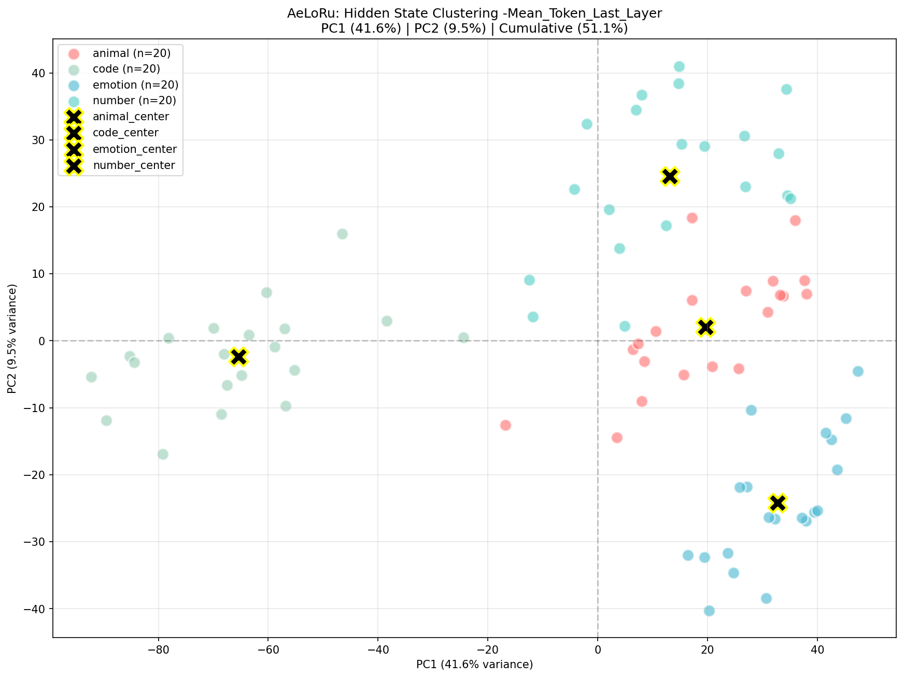

# 📊 隐藏状态语义分析实验报告

实验编号: hidden_states_analysis_v3_20260319_132449
实验时间: 2026-03-19 13:24:49 ~ 13:27:29
总耗时: 160.11 秒
运行设备: CUDA (PyTorch 2.6.0+cu126)

## 1️⃣ 实验概述

### 1.1 实验目标

探究 Qwen2.5-1.5B 大语言模型的隐藏状态（hidden states）中是否编码了语义结构信息，并找出最优的隐藏状态提取策略。

### 1.2 实验配置

| 配置项 | 值 |
| -------- | ----- |
| 模型 | Qwen2.5-1.5B |
| 模型路径 | models/Qwen2.5-1.5B |
| 运行设备 | CUDA |
| 每类样本数 | 20 |
| 语义类别 | animal, code, emotion, number |

总样本数: 80

### 1.3 对比策略

实验对比了 4 种隐藏状态提取策略：

| 策略编号 | 策略名称 | Token 策略 | 层策略 |
| -------- | -------- | ---------- | ------ |
| S1 | Last_Token_Last_Layer | 最后一个 token | 最后一层 |
| S2 | Mean_Token_Last_Layer | 所有 token 平均 | 最后一层 |
| S3 | Last_Token_All_Layers_Mean | 最后一个 token | 所有层平均 |
| S4 | Mean_Token_All_Layers_Mean | 所有 token 平均 | 所有层平均 |

## 2️⃣ 核心实验结果

### 2.1 策略对比总表

| 排名 | 策略 | 分离比 | 轮廓系数 | PCA累计方差(10维) | 类内距离 | 类间距离 |
| ---- | -------- | --------- | ---------- | ------------------ | --------- | --------- |
🥇 | Mean_Token_Last_Layer | 2.303| 0.503| 76.18%| 30.06| 69.22|
🥈 |Last_Token_Last_Layer | 1.854 | 0.431| 66.99%| 43.44| 80.52|
🥉|Last_Token_All_Layers_Mean | 1.687 | 0.396 | 46.58%| 20.52 | 34.61
4️⃣|Mean_Token_All_Layers_Mean| 1.467 | 0.305| 99.72%| 348.88 | 511.70

### 2.2 最佳策略详细指标

🏆 最佳策略：Mean_Token_Last_Layer
聚类质量指标

|指标|数值|评价|
|--------|--------|------|
|分离比 (Separation Ratio)|2.303|✅ 良好 (>2.0)|
|轮廓系数 (Silhouette Score)|0.503|✅ 中等偏上 (>0.5)|
|PCA 前2维累计方差|51.11%|🟡 中等|
|PCA 前10维累计方差|76.18%|✅ 良好|

类内距离（Intra-class Distance）:

|类别|类内距离|紧凑度评价|
|--------|--------|------|
|emotion|24.15|✅ 最紧凑|
|animal|25.03|✅ 紧凑|
|number|28.89|🟡 中等|
|code|42.15|🔴 最分散|

最佳策略 PCA 可视化:

的类内距离显著高于其他类别，表明其语义表示更分散
平均类内距离: 30.06
类间距离（Inter-class Distance）

|类别对|距离|可区分度|
|--------|--------|------|
|code ↔ emotion|101.11|🔴 最易区分|
|code ↔ animal|89.47|🔴 易区分|
|code ↔ number|84.66|🔴 易区分|
|emotion ↔ number|53.57|🟡 中等|
|animal ↔ emotion|45.51|🟡 中等|
|animal ↔ number|40.99|🟡 较近|

平均类间距离: 69.22

## 3️⃣ 关键发现

### 3.1 发现一：最后一层优于所有层平均

|对比项|最后一层|所有层平均|差距|
|--------|--------|--------|------|
|分离比 (Mean Token)|2.303|1.467|+57%|
|轮廓系数 (Mean Token)|0.503|0.305|+65%|

结论: 深层语义信息集中在最后一层，所有层平均会稀释语义信号。

### 3.2 发现二：Token 平均优于 Last Token

|对比项|Mean Token|Last Token|差距|
|--------|--------|--------|------|
|分离比 (Last Layer)|2.303|1.854|+24%|
|轮廓系数 (Last Layer)|0.503|0.431|+17%|

结论: 所有 token 平均能更好地捕捉整体句义，Last Token 可能丢失部分信息。

### 3.3 发现三：Code 类别特殊性

|指标|Code|其他类别平均|差异|
|--------|--------|--------|------|
|类内距离|42.15|26.02|+62%|
|与其他类平均距离|91.75|46.69|+96%|

结论:
Code 的语义表示变异性最大（类内距离大）
Code 与其他语义类别差异最显著（类间距离大

类别的特殊性可能源于其语义范围广泛且抽象，导致模型在隐藏状态中编码时表现出更大的分散性和独特性。

### 3.4 发现四：PCA 方差陷阱

Mean_Token_All_Layers_Mean 策略的 PCA 累计方差高达 99.72%，但聚类效果最差：

|              策略         | PCA 10 维方差 | 分离比 | 轮廓系数 |
|---------------------------|---------------|--------|----------|
| Mean_Token_All_Layers_Mean| 99.72%        | 1.467  | 0.305    |
| Mean_Token_Last_Layer     | 76.18%        | 2.303  | 0.503    |

结论: 高方差解释率 ≠ 好的语义分离，信息过于分散反而不利于聚类。

## 4️⃣ 实验局限性

### 4.1 与研究目标的偏差

| 当前实验 | 原始研究目标 |
| -------- | -------------- |
| 分析隐藏状态 (hidden states) | 分析 LoRA 权重矩阵 W0 |
| 关注输出表示 | 关注权重本身的结构 |
| 聚类语义类别 | 权重与语义的关联 |

⚠️ 重要说明: 本实验未直接研究 LoRA 的 W0 权重，而是分析了模型的隐藏状态表示。虽然结果有效，但与"LoRA 的 W0 关于语义的关系"这一核心研究问题存在偏差。

### 4.2 其他局限性

| 局限性 | 影响 | 建议 |
| -------- | ------ | ------ |
| 仅 4 个语义类别 | 结论泛化性有限 | 扩展至 8-10 个类别 |
| 仅 1.5B 小模型 | 大模型可能表现不同 | 在 7B/14B 模型上验证 |
| 每类 20 样本 | 统计稳定性一般 | 增加至 50-100 样本 |
| 仅中文/英文混合 | 语言差异未控制 | 分语言单独测试 |

## 5️⃣ 结论与建议

### 5.1 核心结论

✅ 隐藏状态确实编码了语义结构：分离比 2.30，轮廓系数 0.50，证明语义类别在隐藏空间可分。
✅ 最优提取策略已确定：Mean_Token_Last_Layer（最后一层 + 所有 token 平均）
✅ 层选择比 Token 选择更重要：最后一层 vs 所有层平均的差距 > Token 策略的差距
⚠️ 实验未直接回答 W0 语义问题：需要额外实验分析权重矩阵本身

### 5.2 后续实验建议

| 优先级 | 实验方向 | 目标 |
| -------- | ---------- | ------ |
| 🔴 P0 | W0 权重 SVD 分析 | 直接研究权重矩阵的语义结构 |
| 🔴 P0 | LoRA 训练前后对比 | 分析 ΔW 与 W0 的语义方向关系 |
| 🟡 P1 | 扩展语义类别 | 验证结论泛化性 |
| 🟡 P1 | 多模型规模对比 | 1.5B → 7B → 14B |
| 🟢 P2 | 下游任务验证 | 用聚类结果做分类任务 |

## 6️⃣ 实验产出物

| 文件类型 | 文件路径 |
| ---------- | ---------- |
| 日志文件 | `AeLoRu/experiment/log/hidden_states_analysis_v3_20260319_132449.log` |
| JSON 结果 | `AeLoRu/experiment/log/hidden_states_analysis_v3_20260319_132449.json` |
| 可视化图 1 | `.../hidden_states_analysis_v3_20260319_132449_Last_Token_Last_Layer.png` |
| 可视化图 2 | `.../hidden_states_analysis_v3_20260319_132449_Mean_Token_Last_Layer.png` |
| 可视化图 3 | `.../hidden_states_analysis_v3_20260319_132449_Last_Token_All_Layers_Mean.png` |
| 可视化图 4 | `.../hidden_states_analysis_v3_20260319_132449_Mean_Token_All_Layers_Mean.png` |

## 7️⃣ 附录：原始数据摘要

最佳策略: Mean_Token_Last_Layer
json
{
  "session_id": "hidden_states_analysis_v3_20260319_132449",
  "total_steps": 320,
  "total_time": 160.10299825668335,
  "device": "cuda",
  "best_strategy": "Mean_Token_Last_Layer",
  "best_separation_ratio": 2.30297132670672,
  "best_silhouette_score": 0.5029744263236783
}
