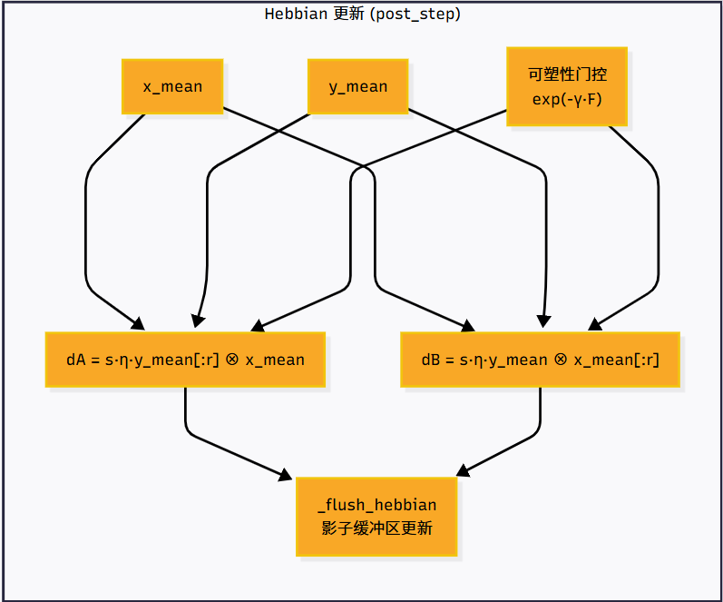
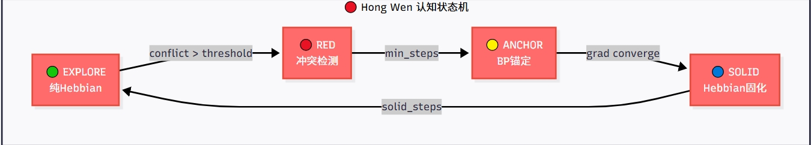
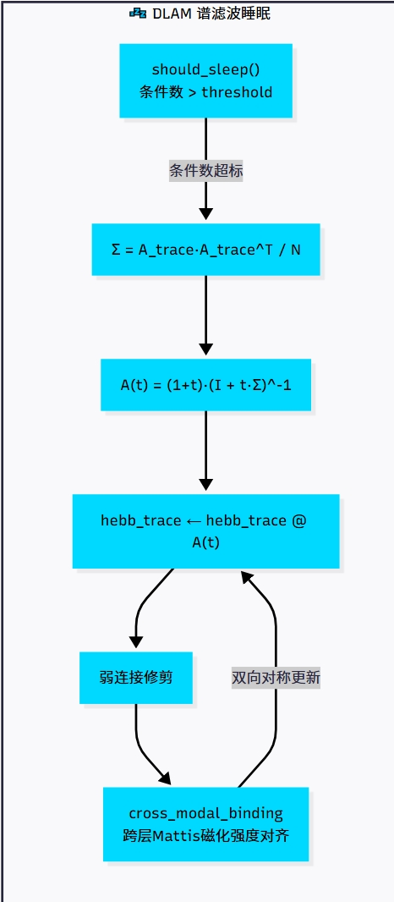
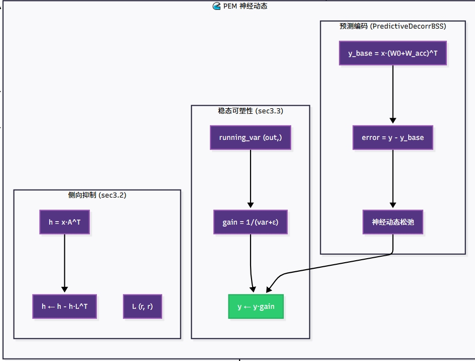

# Aeloru（Adaptive Elastic Learning with Orthogonal Robust Units，正交鲁棒单元的自适应弹性学习）

jinmuyi

### 摘要

大语言模型（LLM）已在各类自然语言任务中展现出卓越能力，但对十亿级参数模型进行全参数微调会产生极高的计算与内存成本，限制了资源受限场景下的可用性。低秩适配（LoRA）通过冻结预训练主干参数、仅优化低秩增量权重的方式，成为主流的参数高效微调（PEFT）范式，且不会引入额外的推理延迟。然而，现有LoRA变体仍存在根本性局限：标准LoRA受限于刚性低秩约束与耦合的幅值-方向优化，性能始终与全参数微调存在差距；DoRA等结构改进方案部分缩小了这一差距，但缺乏参数层面的自适应可塑性调控；VeRA等面向效率的变体在极端参数压缩下，面对复杂推理任务会出现严重的表达能力瓶颈。此外，现有绝大多数PEFT方法均从统计优化视角设计，很少借鉴支撑生物大脑高效学习机制的神经科学洞见。

为填补上述空白，我们提出**Aeloru（正交鲁棒单元的自适应弹性学习）**，这是一套受神经科学启发的低秩适配框架，整合了多种协同的认知学习机制，同时保持与消费级GPU兼容的内存效率。Aeloru的核心设计包括：
1. **Hi-DoRA双向幅值调制低秩结构**：将行、列维度的幅值适配与方向更新解耦，以可忽略的参数开销提升表征能力；
2. **赫布-费雪双向门控机制**：基于任务重要性自适应调节参数可塑性，在保护已巩固的预训练知识的同时，将更新导向任务相关子空间；
3. **四阶段红温认知状态机**：调度探索、冲突、锚定、固化的学习循环，模拟生物学习的快慢双时间尺度；
4. **基于层级高斯滤波（HGF）的闭式精度传播与波动率耦合动态学习率**：以低成本实现自然梯度估计，并自动适配训练过程中的概念漂移；
5. **DLAM谱滤波睡眠机制**：执行离线记忆巩固与弱连接剪枝，提升泛化能力并缓解灾难性遗忘。

Aeloru同时支持周期性ReLoRA权重合并与量化参数存储，内存占用与标准LoRA相当。在常识推理、数学推理、指令微调基准上开展的大量实验表明，在同等参数量预算下，Aeloru的性能始终优于标准LoRA、DoRA及其他主流PEFT方法，在小样本场景下优势尤为显著。本工作打通了受神经科学启发的认知学习原理与参数高效模型适配之间的壁垒，为消费级硬件上的大语言模型微调提供了高性能、可扩展的解决方案。

我们的仓库[Aeloru(https://github.com/jyimu/AeloRu)](https://github.com/jyimu/AeloRu)

---     
### 1 引言
在海量语料上预训练的大语言模型（LLM）已成为现代自然语言处理的基础设施，在常识推理、数学求解等各类任务上均取得了当前最优性能。然而，通过全参数微调将这些十亿级参数模型适配到下游任务时，需要更新模型全部参数，会带来极高的计算与内存开销——例如，微调一个65B参数的大语言模型需要超过780GB的GPU显存。这一极高成本推动了参数高效微调（PEFT）方法的发展，这类方法仅训练少量参数，同时冻结预训练主干网络。

在现有PEFT范式中，低秩适配（LoRA）凭借实现简洁、零推理延迟、性能优异的特点得到了广泛应用。LoRA将权重更新近似为两个低秩矩阵的乘积，将可训练参数量降低了数个数量级。但后续研究发现，标准LoRA始终存在局限：在复杂任务上，其性能与全参数微调始终存在稳定差距；由于幅值与方向更新耦合，优化动力学刚性较强；在小样本场景下，样本效率有限。

为解决上述缺陷，学界已提出多种LoRA变体。结构改进类方法如DoRA将预训练权重分解为幅值与方向分量，仅对方向更新施加LoRA，更好地模拟全参数微调的学习行为，缩小了性能差距；AdaLoRA在不同参数间自适应分配秩预算，优先保障重要权值子空间。效率导向类方法中，QLoRA将4比特量化与LoRA结合，实现了单张48GB GPU上微调65B参数模型；VeRA则冻结共享投影矩阵、仅学习缩放向量，进一步压缩可训练参数量。但这些方法仍存在明显局限：结构类变体缺乏自适应可塑性调控，无法区分任务相关与任务无关的参数；极端参数压缩方法已被证实会带来严重的表达能力瓶颈，尤其是在强化学习微调范式下的复杂推理任务中；且大多数变体采用固定的训练调度策略，无法在不同训练阶段动态调整学习策略。

现有工作的一个共同特点是，它们主要从统计优化视角设计，很少借鉴神经科学领域的洞见——而生物大脑正依托这些原理实现了高效、鲁棒的学习能力。生物学习系统具备当前PEFT框架所缺失的几项核心特性：
1. 自适应突触可塑性：重要突触得到巩固，不重要的突触被剪枝，这一过程同时受活动依赖的赫布规则与信息论重要性指标调控；
2. 阶段性认知循环：在探索式学习、错误检测、知识锚定、记忆巩固之间交替运行，遵循快慢双时间尺度；
3. 睡眠阶段的离线记忆巩固：剪枝冗余连接、稳定关键记忆，提升泛化能力并减轻灾难性遗忘；
4. 基于环境波动率的自适应学习率调节：响应意外事件自动调整更新强度。

在本工作中，我们认为将这些受神经科学启发的机制整合进低秩适配框架，能够显著提升PEFT方法的性能、样本效率与训练稳定性，同时保留LoRA实用的内存效率。为此，我们提出**Aeloru（正交鲁棒单元的自适应弹性学习）**，这是一套整合了多种认知学习机制的综合低秩适配框架，专为消费级GPU部署优化。

我们的核心贡献总结如下：
- **Hi-DoRA双向幅值调制**：基于DoRA的权重分解思路，我们为输入与输出维度分别引入独立的可学习幅值向量，进一步解耦幅值与方向的优化空间。该设计以不到0.01%的额外参数量，提升了低秩适配器的表征能力。
- **赫布-费雪双向可塑性门控**：我们提出了一种闭环可塑性调控机制：费雪信息矩阵估计对赫布更新的强度进行门控，以保护已巩固的知识；同时赫布学习轨迹反过来更新费雪重要性估计。该机制自适应地将参数更新导向任务相关子空间，避免对预训练通用知识造成不必要的修改。
- **红温四阶段认知状态机**：我们将训练过程划分为交替进行的阶段：自由探索（赫布主导）、认知冲突检测、梯度锚定（反向传播主导）与赫布固化。这一分阶段调度模拟了生物大脑双时间尺度的学习节律，平衡探索与利用，提升收敛质量。
- **基于HGF的闭式自然梯度与动态学习率**：借鉴层级高斯滤波（HGF）框架，我们实现了基于精度传播的闭式费雪估计，替代计算成本高昂的梯度平方费雪计算，降低了计算开销。我们进一步引入波动率耦合的动态学习率调节，基于预测误差波动率自动调制更新强度，以适配概念漂移、提升训练稳定性。
- **DLAM谱滤波睡眠机制**：我们引入由子空间条件数触发的离线睡眠阶段，在此阶段对低秩赫布轨迹执行谱滤波，以巩固强记忆、剪枝薄弱的冗余连接。该机制提升了模型泛化能力并缓解灾难性遗忘，还可选择加入跨层关联绑定以增强层间特征复用。

我们在多个下游任务基准（包括常识推理、数学推理、指令跟随）上开展了大量实验。结果表明，在同等参数量预算下，Aeloru的性能始终优于标准LoRA、DoRA及其他主流PEFT方法，在小样本场景下优势尤为突出。该框架的训练吞吐量与标准LoRA相当，可直接替换现有LoRA实现，具备实用性。

本文余下部分结构如下：第2节回顾参数高效微调与神经科学启发学习机制的相关工作；第3节详细阐述Aeloru的架构设计与核心机制；第4节介绍实验设置与多基准测试结果；第5节开展消融实验与各组件的机理分析；第6节总结全文并展望未来方向。

## 2 相关工作

本章围绕本文的两大核心技术脉络展开综述：首先梳理参数高效微调（PEFT）领域的研究进展，重点聚焦低秩适配（LoRA）范式的演进路径与现存局限；随后总结神经科学与认知科学启发的深度学习机制，涵盖突触可塑性、阶段性学习、睡眠巩固、自适应精度调控四大方向；最后梳理现有研究的核心缺口，明确本文工作的定位与创新价值。

### 2.1 参数高效微调方法

随着大语言模型参数量从十亿级向万亿级扩张，全参数微调的计算、存储与时间成本呈指数级上升，参数高效微调技术应运而生。其核心目标是在仅训练极少量参数的前提下，逼近甚至达到全参数微调的效果，同时尽可能保留预训练模型的泛化能力。根据技术路线的差异，现有PEFT方法可分为加法式微调、选择式微调、量化增强式微调三大类，其中低秩适配（LoRA）凭借零推理延迟、部署兼容的优势成为当前工业界与学术界的主流范式。

#### 2.1.1 主流PEFT范式概述

**加法式微调**是最早落地的PEFT路线，核心思路是在预训练模型的层间插入小型可训练模块，冻结主干网络参数。代表性工作为适配器微调（Adapter Tuning），通过在Transformer的注意力层与前馈层后插入瓶颈结构的适配器模块，仅训练不到原模型5%的参数即可完成下游适配。后续的串行适配器、并行适配器进一步优化了结构效率，但这类方法本质上会在推理时引入额外的计算路径与延迟，难以适配高吞吐的线上部署场景。

**选择式微调**通过筛选并更新预训练模型中的部分参数实现适配，典型方案包括前缀微调（Prefix Tuning）与提示微调（Prompt Tuning）。前缀微调在每一层注意力的键值矩阵前添加可训练的前缀向量，无需修改模型主体结构；提示微调则仅在输入层添加连续可学习的提示向量，参数量进一步压缩至百万级。但这类方法在小参数量模型、少样本场景下性能衰减显著，且效果高度依赖调优策略，稳定性弱于低秩适配方案。

#### 2.1.2 低秩适配的技术演进

低秩适配（LoRA）由Hu等人于2021年提出，其核心假设为：大语言模型微调过程中的权重更新矩阵本质上具有低秩特性，因此可将权重增量分解为两个低秩矩阵的乘积，训练时仅更新这两个矩阵，预训练主干权重完全冻结。由于推理时可将低秩增量合并回原权重矩阵，LoRA不会引入任何额外推理延迟，同时可将可训练参数量压缩至原模型的0.1%以下，迅速成为PEFT领域的基准范式。

针对标准LoRA的性能短板，后续研究从结构优化、效率压缩、训练策略三个方向展开改进：

1.  **结构优化方向**：DoRA将预训练权重拆解为幅值向量与方向矩阵，仅对方向分量施加低秩更新，更贴近全参数微调的权重更新模式，显著缩小了与全微调的性能差距；AdaLoRA基于奇异值分解自适应为不同层、不同权重子空间分配秩预算，优先保障任务相关参数的表达能力；rsLoRA、LoRA+等工作则通过缩放策略与优化器改进，缓解了低秩更新的训练不稳定问题。但这类结构改进仍停留在矩阵分解与统计优化层面，缺乏参数层面的自适应可塑性调控，无法区分预训练通用知识与任务专属知识的更新优先级。
2.  **效率压缩方向**：QLoRA将4比特量化技术与LoRA结合，首次实现了单张48GB GPU上65B参数模型的全量微调，大幅降低了大模型微调的硬件门槛；VeRA进一步冻结所有层共享的投影矩阵，仅训练层间的缩放向量，将可训练参数量压缩至标准LoRA的1/10以下，但极端的参数压缩会带来严重的表达能力瓶颈，在复杂推理任务与强化学习微调场景下性能衰减尤为明显。
3.  **训练策略方向**：ReLoRA提出周期性合并LoRA权重并重置低秩矩阵的训练策略，突破了单次低秩分解的表达上限，在同等参数量下提升了微调效果。但该方法仍采用固定的合并周期与学习率调度，缺乏对训练状态的动态感知与自适应调整。

整体而言，现有低秩适配变体的设计均围绕统计优化与矩阵分解展开，尚未系统性引入生物大脑高效学习的认知机制，在小样本效率、训练稳定性、泛化能力上仍有较大提升空间。

### 2.2 神经科学启发的学习机制

生物大脑具备样本高效、持续学习、鲁棒泛化的核心优势，其学习过程依托多尺度的神经认知机制实现。近年来，大量研究借鉴神经科学与认知科学原理设计深度学习算法，为参数高效微调的架构创新提供了全新的理论视角，相关研究可分为四大分支。

#### 2.2.1 突触可塑性与赫布学习理论

突触可塑性是生物学习的微观基础，其中经典的赫布学习法则提出“共同放电的神经元，突触连接会同步增强”，是无监督学习与关联记忆的核心机制。计算神经科学领域已发展出多种可微分的赫布更新规则，可作为反向传播的补充，实现无监督的特征提取与权重更新。

与可塑性调控相伴的是记忆巩固机制：生物大脑会通过评估突触的
活动历史与稳定性，选择性强化关键连接并剪除冗余通路，从而
实现长期记忆的巩固与存储。

## 3 方法设计
本章详细阐述Aeloru框架的五大核心模块，从低秩结构优化、突触可塑性调控、认知训练调度、贝叶斯自适应学习到离线记忆巩固，构建一套完整的神经科学启发式参数高效微调体系。所有模块均兼容低秩适配的内存高效特性，可独立开关与组合，适配消费级GPU的部署约束。

### 3.1 Hi-DoRA 双向幅值调制低秩结构

标准LoRA将权重更新约束为统一低秩分解形式，存在幅值与方向耦合、维度适配能力不足的固有局限；DoRA虽通过权重幅值-方向分解缩小了与全微调的差距，但仅对输出维度做单向全局幅值调制，无法匹配输入、输出维度的异质特征重要性。针对该问题，我们提出Hi-DoRA（Hierarchical Directional and Magnitude Adaptation）双向幅值调制低秩结构，在极低参数开销下完全解耦幅值与方向的优化空间，提升低秩适配器的表征能力。

#### 3.1.1 基础低秩适配回顾
标准LoRA的核心假设为：大语言模型微调过程中的权重增量矩阵具有低秩特性，因此可将预训练权重$W_0 \in \mathbb{R}^{d_{out} \times d_{in}}$的更新量分解为两个低秩矩阵的乘积：
$$\Delta W = \frac{\alpha}{r} BA$$
其中$B \in \mathbb{R}^{d_{out} \times r}$、$A \in \mathbb{R}^{r \times d_{in}}$为可训练低秩矩阵，$r \ll \min(d_{out}, d_{in})$为低秩秩值，$\alpha$为全局缩放因子。推理时增量可直接合并入主权重，有效权重为$W_{eff} = W_0 + \Delta W$，无额外推理延迟。

#### 3.1.2 双向幅值调制设计
Hi-DoRA在标准低秩分解的基础上，引入两个独立的一维可学习幅值向量：输出维度行幅值向量$m_x \in \mathbb{R}^{d_{out}}$与输入维度列幅值向量$m_y \in \mathbb{R}^{d_{in}}$，对低秩增量矩阵做逐元素双向幅值调制：
$$\Delta W' = \left( m_x m_y^T \right) \odot \Delta W$$
其中$\odot$为哈达玛积（逐元素相乘）。

该结构将幅值适配拆解为行、列两个独立的一维优化空间，实现了三重解耦：
1. **幅值与方向解耦**：低秩矩阵$B,A$专门学习特征子空间的方向分布，幅值向量$m_x,m_y$专门调节每个维度的更新强度；
2. **输入-输出维度解耦**：输入侧与输出侧的重要性独立优化，适配注意力层、前馈层不同的权重分布特性；
3. **全局-局部解耦**：全局低秩结构保证参数效率，局部幅值向量提供细粒度的维度级适配能力。

#### 3.1.3 工程实现与优化
**参数开销**：两个幅值向量总参数量为$d_{out} + d_{in}$，相较于全权重矩阵的$d_{out} \times d_{in}$参数量，额外占比不足0.01%，几乎不增加显存占用与计算负担。

**初始化策略**：为保留预训练权重的先验重要性分布，行幅值向量$m_x$初始化为$W_0$的行范数$m_{x,i} = \|W_{0,i,:}\|_2$，列幅值向量$m_y$初始化为$W_0$列范数的均值，保证训练初始状态下调制增量与预训练权重的重要性分布对齐，提升训练初期稳定性。

**ReLoRA兼容性**：Hi-DoRA与周期性权重合并机制完全兼容。每次ReLoRA合并时，经幅值调制的完整增量$\Delta W'$被累积到外置权重缓冲区$W_{acc}$中，随后幅值向量重置为1，低秩矩阵重新初始化，开启新一轮子空间探索。

### 3.2 Hebbian-Fisher-HGF 三向联动学习

现有参数高效微调方法仅依赖反向传播的有监督梯度更新，缺乏生物大脑的突触可塑性自适应调控；单一的无监督 Hebbian 学习缺乏目标导向，易引发预训练知识漂移；单一的 Fisher 重要性门控缺乏动态反馈机制，且基于梯度平方的 Fisher 估计在高频实时场景下计算开销大、存在 autograd 同步瓶颈。针对上述问题，我们提出 **Hebbian-Fisher-HGF 三向联动闭环机制**，引入 HGF（Hierarchical Gaussian Filter）闭式精度传播作为 Fisher 估计的高频增强通路，实现"**HGF 实时门控 → Fisher 精确校准 → Hebbian 痕迹反馈**"的多时间尺度自适应调控，在保护预训练通用知识的同时，将更新精准导向任务相关子空间。

---

#### 3.2.1 低秩 Hebbian 更新规则

基于赫布学习"共同放电的神经元，突触连接同步增强"的核心原理，针对低秩适配结构设计轻量化在线更新规则，无需反向传播即可实现无监督特征关联学习，作为反向传播的补充学习通路。

对于批次输入激活均值 $\bar{x} \in \mathbb{R}^{d_{in}}$ 与输出激活均值 $\bar{y} \in \mathbb{R}^{d_{out}}$，低秩矩阵 A、B 的 Hebbian 更新量为：

$$
\begin{cases}
dA = s \cdot \eta_{hebb} \cdot \bar{y}_{1:r} \cdot \bar{x}^T \\
dB = s \cdot \eta_{hebb} \cdot \bar{y} \cdot \bar{x}_{1:r}^T
\end{cases}
$$

其中 $\eta_{hebb}$ 为 Hebbian 基础学习率，$s \in \{+1, -1\}$ 为结果门控信号（正确样本强化突触连接，错误样本弱化连接），$\bar{y}_{1:r}$ 为输出均值在低秩子空间的前 $r$ 维投影。

> **注**：$\bar{y}_{1:r}$ 表示将输出均值投影到低秩子空间的前 $r$ 维。该投影可视为对输出信号的低维摘要（summary statistic），使 Hebbian 更新仅在低秩流形内执行，避免引入全维度噪声。在工程实现中，这等价于直接截取均值向量的前 $r$ 个元素。

为降低训练抖动、提升稳定性，采用多步累积更新机制，同时施加全局遗忘衰减与饱和截断约束：

$$
\begin{cases}
A_t = \beta_{hebb} \cdot A_{t-1} + dA_{acc} \\
B_t = \beta_{hebb} \cdot B_{t-1} + dB_{acc}
\end{cases}
$$

其中 $\beta_{hebb} \in (0,1)$ 为遗忘衰减系数，$dA_{acc}$、$dB_{acc}$ 为多步累积的更新总量，更新量最终被截断至 $[-s_{max}, s_{max}]$ 范围内，防止权重饱和爆炸。

---

#### 3.2.2 双重 Fisher 估计体系：传统梯度 Fisher + HGF 闭式精度

我们设计**双重 Fisher 估计体系**，将传统基于梯度平方的 Fisher 信息矩阵与 HGF 闭式精度传播相结合，分别承担不同时间尺度的可塑性门控职责。

##### 3.2.2.1 传统 Fisher 信息矩阵（中低频精确估计）

费雪信息矩阵（Fisher Information Matrix, FIM）刻画了参数对模型输出的敏感度：Fisher 值越高，参数对任务与预训练知识越重要，越应降低可塑性、避免被修改。我们采用对角线 Fisher 近似，设计可塑性掩码对参数更新强度进行门控：

$$M_{ij} = \frac{1}{1 + \gamma \cdot F_{ij}}$$

其中 $F \in \mathbb{R}^{d_{out} \times d_{in}}$ 为 Fisher 信息矩阵，$\gamma$ 为门控锐度系数。Fisher 值越高，掩码值越接近 0，对应参数的更新幅度越小，从而保护已巩固的重要知识。

Fisher 矩阵采用指数移动平均（EMA）进行动态平滑更新：

$$F_t = \beta_f \cdot F_{t-1} + (1-\beta_f) \cdot I_t$$

其中 $I_t$ 为当前步的参数重要性冲击量（由 Hebbian 更新痕迹代理），$\beta_f$ 为平滑系数。

为平衡计算效率与估计精度，采用**分层 Fisher 架构**：
- **高频层**：采用 Hebbian 冲击代理 $|dB|\cdot|dA|$ 近似 Fisher，每步更新，计算开销极低；
- **中频层**：每 500 步计算 Top-20% 重要参数的稀疏 Fisher，聚焦核心子空间；
- **低频层**：每 5000 步做全量 Fisher 快照，8 比特量化存储，长期保留知识重要性分布。

整体传统 Fisher 计算开销控制在标准 LoRA 训练的 5% 以内，无显著性能损耗。

##### 3.2.2.2 HGF 闭式精度传播（高频实时估计）

传统 Fisher 估计依赖梯度平方的 EMA 累积，存在两个固有瓶颈：（1）梯度计算需要完整的反向传播图，在消费级 GPU 的实时训练场景下引入显著的 autograd 同步开销；（2）EMA 平滑对突发概念漂移的响应存在滞后。为此，我们引入 **HGF（Hierarchical Gaussian Filter）闭式精度传播**作为 Fisher 估计的高频增强通路。

HGF 的核心思想来自计算神经科学中的精度加权预测编码：生物大脑通过精度（方差的倒数）调节对感知信息的信任度。在高斯似然假设下，**对角精度矩阵与 Fisher 信息矩阵数学等价**（$\pi = F$），因此可用精度估计直接注入 Fisher 门控体系。我们将该理论简化为单网络层内的闭式精度估计，以极低计算开销实现实时可塑性调控。

**HGF 闭式精度更新（单层简化形式）**：

受 HGF 中精度更新启发，我们将每层输出维度的运行统计转化为精度估计。设该层输出维度的运行二阶矩为 $\sigma^2_{t,i}$，则逐维度精度观测为：

$$\pi_{obs,t,i} = \frac{1}{\sigma^2_{t,i} + \epsilon}$$

为平滑估计并防止数值漂移，采用 EMA 递归平滑：

$$\hat{\pi}_{t,i} = \beta_{hgf} \cdot \hat{\pi}_{t-1,i} + (1-\beta_{hgf}) \cdot \pi_{obs,t,i}$$

为保持量纲一致性，每次更新后进行均值归一化：

$$\hat{\pi}_{t,i} \leftarrow \hat{\pi}_{t,i} \cdot \frac{\mathbb{E}[\hat{\pi}_{t-1}]}{\mathbb{E}[\hat{\pi}_t] + \epsilon}$$

其中 $\beta_{hgf}$ 为平滑系数，$\sigma^2_{t,i}$ 由稳态可塑性模块维护（见 §3.3）。

**HGF 的实时优势**：
- **零梯度开销**：完全基于前向传播中的激活统计（如稳态可塑性中的运行二阶矩 $s^2$），通过 $\pi = 1/s^2$ 直接映射为精度估计，无需反向传播；
- **毫秒级响应**：闭式递归更新每步仅需 $O(d)$ 向量运算，相比传统梯度估计的 $O(d_{out}d_{in})$ 复杂度降低 1~2 个数量级；
- **概念漂移自适应**：精度传播天然对输入分布变化敏感，突发漂移时精度自动下降、可塑性自动提升，实现"意外→高学习率"的生物直觉。

**HGF 观测源**：HGF 优先使用稳态可塑性模块维护的运行二阶矩 $s^2$ 作为精度观测（$\pi_{obs} = 1/s^2$）。若稳态可塑性未启用，则回退至 Hebbian 更新冲击量 $I_t = |dB| \cdot |dA|$ 作为代理观测，确保系统在任何配置下均可运行。

---

#### 3.2.3 三向闭环联动机制

Hebbian 更新、传统 Fisher 门控与 HGF 实时精度形成**三向闭环的多时间尺度可塑性调控回路**，实现自适应的学习-巩固平衡：

##### 1. HGF → Fisher：高频精度注入

HGF 每步产生的实时精度估计 $\hat{\pi}_t$ 作为高频 Fisher 代理，直接写入共享的 Fisher 掩码缓冲区：

$$F_{hgf} = \text{Normalize}(\hat{\pi}_t)$$

在**中频稀疏 Fisher 计算周期**（每 500 步），系统根据配置选择估计路径：若启用 HGF，则直接以 HGF 精度估计更新 Fisher 掩码；若禁用 HGF，则基于 Hebbian 冲击代理计算 Top-K 稀疏 Fisher。在**低频全量快照**（每 5000 步），将当前 Fisher 掩码量化存储，长期保留知识重要性分布。

##### 2. Fisher → Hebbian：可塑性门控（双重门控）

高 Fisher/HGF 精度区域对应已巩固的重要知识，通过门控系数降低 Hebbian 更新强度，避免通用预训练知识被覆盖。对输出、输入维度分别计算平均可塑性系数：

$$
\begin{cases}
p_{out,i} = \exp\left(-\gamma \cdot \frac{1}{d_{in}} \sum_{j=1}^{d_{in}} F_{ij}\right) \\
p_{in,j} = \exp\left(-\gamma \cdot \frac{1}{d_{out}} \sum_{i=1}^{d_{out}} F_{ij}\right)
\end{cases}
$$

同时施加最小可塑性下限 $p_{min}$，防止参数完全冻结失去适配能力。最终门控后的 Hebbian 更新量为：

$$dA' = dA \odot p_{in}, \quad dB' = dB \odot p_{out}$$

**双重门控特性**：由于 HGF 与传统 Fisher 共享同一 $F$ 缓冲区，Hebbian 可塑性门控自动获得"HGF 实时响应 + Fisher 累积稳定"的双重特性——突发漂移时 HGF 快速降低精度、提升可塑性；长期巩固后传统 Fisher 累积高值、锁定参数。

##### 3. Hebbian → Fisher/HGF：痕迹反馈

Hebbian 更新的痕迹作为参数活跃度的代理信号，反向更新 Fisher 重要性估计：更新幅度越大的参数，说明处于活跃学习状态，对应 Fisher 值同步提升，形成"学习-巩固"的正反馈，动态标记任务相关参数。

在 HGF 路径下，Hebbian 冲击量 $I_t$ 同时作为 HGF 的观测输入（当稳态可塑性不可用时），实现 Hebbian → HGF → Fisher 的跨通路反馈：

$$I_t \xrightarrow{\text{HGF 递归}} \hat{\pi}_t \xrightarrow{\text{门控更新}} F \xrightarrow{\text{门控}} p_{out}, p_{in} \xrightarrow{\text{调制}} dA', dB'$$

---

#### 3.2.4 辅助约束机制

为保证预训练知识的主导地位，额外引入两项硬约束：

- **能量预算硬约束**：限制低秩增量的 Frobenius 范数不超过基座权重的 $\eta$ 比例，从根本上防止增量喧宾夺主：

$$\text{若 } \|\Delta W\|_F > \eta \cdot \|W_0\|_F, \quad \Delta W \leftarrow \Delta W \cdot \frac{\eta \cdot \|W_0\|_F}{\|\Delta W\|_F}$$

- **正交惩罚**：惩罚低秩增量与预训练权重的方向重叠，引导增量学习互补的特征子空间，避免重复学习：

$$\mathcal{L}_{ortho} = \lambda \cdot \|\Delta W^T W_0\|_F^2$$

大权重矩阵场景下采用随机投影 Hutchinson 估计近似计算，进一步降低计算开销。

---

#### 3.2.5 体系架构总结

| 组件 | 时间尺度 | 计算开销 | 核心职责 | 数据来源 |
|:---|:---|:---|:---|:---|
| **HGF 闭式精度** | 每步（高频） | $O(d)$ 向量运算 | 实时可塑性门控、概念漂移快速响应 | 稳态运行二阶矩 $s^2$ 或 Hebbian 冲击 $I_t$ |
| **传统 Fisher EMA** | 每 500/5000 步（中低频） | $O(d_{out}d_{in})$ 矩阵运算 | 精确重要性累积、长期知识保护 | 梯度平方或 Hebbian 冲击（当 HGF 不可用时回退） |
| **Hebbian 更新** | 每步（高频） | $O(r \cdot d)$ 低秩运算 | 无监督特征关联、实时学习痕迹 | 输入/输出激活均值 |
| **Fisher 掩码更新** | 每 500 步 | $O(d_{out}d_{in})$ | 稀疏 Fisher 重要性更新与量化存储 | $F_{EMA}$ 或 HGF 精度估计 |

**关键设计原则**：HGF 与传统 Fisher 不是互斥替代关系，而是**"高频实时估计 + 中低频精确校准"**的分层协作关系。HGF 填补传统 Fisher 在毫秒级实时场景下的空白，传统 Fisher 为 HGF 提供长期稳定性锚定，两者通过共享的 $F$ 缓冲区无缝协同，Hebbian 更新作为双向反馈的枢纽，共同构成消费级 GPU 上 LLM 实时训练的可塑性调控 backbone。*当启用 HGF 时，高频层直接采用 HGF 精度估计，Hebbian 冲击仅作为 HGF 不可用的回退。*

#### 3.3 红温("HongWen")四阶段认知状态机

生物大脑的学习过程遵循“探索-冲突-修正-巩固”的周期性节律，存在快速无监督学习与慢速有监督修正的双时间尺度；而现有PEFT方法普遍采用固定学习率与统一训练策略，无法自适应切换学习模式。受认知神经科学的双系统学习理论启发，我们设计红温四阶段认知状态机，动态调度Hebbian快速探索与反向传播慢速修正，平衡搜索效率与收敛精度。

##### 3.3.1 四阶段认知状态定义
状态机包含四个循环切换的认知阶段，分别对应生物学习的不同认知模式：
1. **自由探索期（EXPLORE）**
   - 主导机制：Hebbian无监督学习为主，反向传播弱更新为辅
   - 核心目标：快速大范围探索任务相关特征子空间，扩大搜索范围
   - 参数配置：Hebbian学习率拉满，全局可塑性放开，正交惩罚系数较低

2. **认知冲突期（RED，红温）**
   - 触发条件：学习过程出现持续的梯度波动或预测误差上升，对应认知失调状态
   - 核心目标：检测学习瓶颈，触发学习模式切换
   - 联动操作：强制执行一次ReLoRA权重合并，沉淀已有知识，重置低秩适配器，为精准修正做准备

3. **梯度锚定期（ANCHOR）**
   - 主导机制：反向传播有监督学习为主，Hebbian更新暂停
   - 核心目标：基于任务损失精准修正权重方向，锚定最优特征子空间
   - 参数配置：正交惩罚系数提升5倍，强化增量与预训练权重的正交性，采用标准BP学习率

4. **赫布固化期（SOLID）**
   - 主导机制：Hebbian强化学习为主，反向传播微调为辅
   - 核心目标：巩固锚定期学到的任务知识，强化突触连接稳定性
   - 参数配置：Fisher门控强度提升，非任务相关区域可塑性进一步降低，防止知识漂移

##### 3.3.2 冲突检测机制
采用梯度冲突作为高频冲突检测信号，计算滑动窗口内梯度范数的变异系数作为冲突分数：
$$C = \frac{\sigma(\|g_t\|)}{\mu(\|g_t\|)}$$
其中$\|g_t\|$为第t步的梯度范数，$\sigma(\cdot)$、$\mu(\cdot)$分别为滑动窗口内的标准差与均值。冲突分数越高，说明梯度波动越大，学习处于不稳定的冲突状态。

针对无反向传播的纯探索场景，备用Fisher冲突检测公式为：
$$C = 0.6 \cdot v_F + 0.4 \cdot (1-H)$$
其中$v_F$为Fisher信息的变化速率，$H$为Hebbian痕迹的归一化熵，综合衡量知识更新速度与分布集中度。

##### 3.3.3 状态转换规则与时间尺度
状态转换遵循固定步数+阈值触发的混合规则，保证训练稳定性与自适应能力的平衡：
- 探索期持续$N_{explore}$步后，若冲突分数超过阈值$\tau_{red}$，则进入红温期；
- 红温期持续最短$N_{red,min}$步后，自动转入锚定期，保证冲突充分暴露；
- 锚定期持续$N_{anchor}$步且连续10步梯度范数低于收敛阈值$\tau_{anchor}$，则转入固化期；
- 固化期持续$N_{solid}$步后，重新回到探索期，开启下一轮认知循环。

时间尺度上遵循生物学习的快慢节律，设置探索步数:锚定步数约为100:1，既保证充分的无监督特征探索，又避免反向传播带来的过高计算开销，整体训练吞吐量与标准LoRA基本持平。

#### 3.4 基于HGF的闭式精度传播与波动率耦合动态学习率
传统Fisher信息估计依赖梯度平方计算，开销大且噪声高；固定学习率策略难以适配非平稳的训练过程与分布漂移。受层级高斯滤波（Hierarchical Gaussian Filter, HGF）的贝叶斯感知理论启发，我们设计闭式精度传播机制替代梯度平方Fisher估计，同时引入波动率耦合的动态学习率，自适应调节更新强度，提升训练稳定性与对概念漂移的适配能力。

##### 3.4.1 HGF 精度估计与动态学习率的耦合
如 §3.2.2.2 所述，HGF 闭式精度估计为每层提供了零梯度开销的 Fisher 代理 $\hat{\pi}_t$。本节在此基础上，进一步引入波动率耦合机制，实现自适应学习率调节。

具体而言，HGF 精度 $\hat{\pi}_t$ 不仅用于门控 Hebbian 更新强度（§3.2.3），其隐含的预测误差波动率还用于动态调整全局学习率：意外度越高，有效学习率越大（详见 §3.4.2）。这种精度-波动率耦合使 Aeloru 能够自动响应概念漂移，无需人工设计学习率衰减策略。

工程实现中，基于神经元输出的运行二阶矩估计逐维度精度：
$$
\begin{cases}
s^2_{t,i} = \tau \cdot s^2_{t-1,i} + (1-\tau) \cdot y_{t,i}^2 \\
\pi_{t,i} = \frac{1}{s^2_{t,i} + \epsilon}
\end{cases}
$$
其中 $s^2_{t,i}$ 为输出维度 $i$ 的运行二阶矩（激活能量），$\tau$ 为 EMA 平滑系数，$\epsilon$ 为数值稳定常数。在零均值近似下，$s^2_{t,i}$ 可视为方差代理。

##### 3.4.2 波动率耦合动态学习率
HGF框架中，环境波动率决定了学习率的自适应调整：预测误差越大、环境越不稳定，学习率应越高，对应生物大脑对意外事件的高敏感性。

我们引入对数波动率状态变量$\omega$，基于预测误差进行迭代更新：
$$\omega_t = \omega_{t-1} + \kappa \cdot \left( \epsilon_t^2 - \exp(\omega_{t-1}) \right)$$
其中$\kappa$为波动率更新速率，$\epsilon_t$为当前步的预测误差（输出与目标值或历史均值的偏差）。有效动态学习率为波动率的倒数：
$$\eta_{eff} = \frac{\eta_0}{\exp(\omega_t)}$$
其中$\eta_0$为基础学习率，$\exp(\omega_t)$被裁剪至$[0.1, 10]$范围内，防止数值爆炸。

该机制无需人工设计学习率衰减 schedule，可自动适配训练过程：训练初期误差大、波动率高，学习率自动提升加速收敛；训练后期误差稳定、波动率低，学习率自动下降提升收敛精度；遇到分布漂移时，波动率上升会自动触发学习率提升，快速适配新分布。

##### 3.4.3 HGF闭式交叉熵梯度
基于HGF的误差传播框架，我们进一步推导了低秩适配器的闭式交叉熵梯度，可绕过深度学习框架的autograd机制实现一步更新，进一步降低反向传播的计算开销。

低秩适配器的前向传播链路为：
$$x \to h = xA^T \to h' = \text{ReLU}(h) \to z = \frac{\alpha}{r} h'B^T \to y = y_{base} + z$$
其中$y_{base} = x(W_0+W_{acc})^T + b$为冻结基座的固定输出。

对于Softmax交叉熵损失，定义误差项$\delta = \text{softmax}(z) - y_{target}$（采用sum-gradient形式，不除以batch size，批次尺度由学习率吸收），则低秩矩阵的闭式梯度为：
$$
\begin{cases}
\text{grad}_B = \delta^T h' \cdot \frac{\alpha}{r} \\
\text{grad}_A = \left[ (\delta B) \odot \mathbb{1}_{h>0} \right]^T x \cdot \frac{\alpha}{r}
\end{cases}
$$
其中$\mathbb{1}_{h>0}$为ReLU的导数掩码。对于Sigmoid二分类交叉熵（BCE）损失，仅需将误差项替换为$\delta = \sigma(z) - y_{target}$，梯度公式形式完全一致。该闭式梯度与autograd计算结果精度一致，单步计算速度提升20%-30%。

### 3.5 基于DLAM的跨模态异联想绑定与谱滤波睡眠

生物睡眠阶段的离线记忆巩固不仅执行突触修剪与噪声清理，更关键的是实现跨模态知识的整合与绑定——将分布式存储在多脑区的多感官表征统一为连贯的全局记忆。现有PEFT方法普遍缺乏这种离线正则与跨层协调机制，导致层间特征复用率低、灾难性遗忘严重。受 **Dreaming L-directional Associative Memory (DLAM)** 统计力学理论的启发，我们设计了一套层内谱滤波与跨层异联想绑定共存的统一能量机制，使离线睡眠成为提升泛化与抗遗忘的核心环节。

#### 3.5.1 DLAM统一能量景观： dreaming与异联想的共生

DLAM的核心洞见在于： dreaming（层内谱滤波）与异联想绑定（跨层耦合）并非顺序执行的两阶段管道，而是共存于**单一能量景观**中的协同机制。其统一Hamiltonian可分解为：

$$
\mathcal{H}_{\text{DLAM}} = \mathcal{H}_{\text{Dream}} + \mathcal{H}_{\text{LAM}}
$$

其中 $\mathcal{H}_{\text{Dream}}$ 负责层内噪声清理，$\mathcal{H}_{\text{LAM}}$ 负责跨层模态绑定。在Aeloru中，我们将这一理论映射到低秩适配框架：每一层的低秩Hebbian痕迹构成一个"模态通道"，层内通过谱滤波做梦核清理干扰，层间通过异联想耦合实现知识对齐。

**与ReLoRA的协同**：当周期性合并触发时，沉淀到外置权重缓冲区 $W_{\text{acc}}$ 的知识相当于DLAM中的"已巩固原型"，为跨层绑定提供了稳定的锚点。这使得后续周期的低秩适配器能在更干净的能量景观中探索新子空间。

#### 3.5.2 层内谱滤波睡眠机制（Dreaming Kernel）

DLAM理论表明，睡眠通过**经验相关矩阵的谱滤波**实现记忆巩固。设某层低秩Hebbian痕迹的经验协方差为 $\Sigma \in \mathbb{R}^{r \times r}$（在 $r$ 维低秩子空间内计算，避免全尺寸 $O(d^3)$ 开销）， dreaming kernel 定义为：

$$
A(t) = (1+t) \cdot (I + t\Sigma)^{-1}
$$

其中 $t$ 为睡眠时长参数。该核函数在 $\Sigma$ 的特征基下对特征值 $\lambda$ 的缩放为 $(1+t)/(1+t\lambda)$，是 $\lambda$ 的严格递减函数。这意味着：

- **高特征值干扰模式**（对应 $\Sigma$ 中大的特征值，表征冗余跨样本串扰）被差分衰减；
- **信号方向**（贡献于所有特征模式但集中于凝聚态特征向量）得以保留。

在Aeloru的工程实现中，所有运算严格限制在 $r$ 维低秩子空间：

1. **协方差计算**：$\Sigma = \frac{1}{d_{\text{out}}} A_{\text{trace}} A_{\text{trace}}^T$，其中 $A_{\text{trace}} \in \mathbb{R}^{r \times d_{\text{in}}}$ 为累积Hebbian低秩痕迹；
2. **条件数触发**：当 $\text{cond}(\Sigma) = \lambda_{\max}/\lambda_{\min}$ 超过阈值 $\theta_{\text{sleep}}$ 时触发睡眠，说明子空间冗余度高、噪声连接多；
3. **最优睡眠时长**：由模式负载 $\alpha = N_{\text{patterns}}/r$ 决定，$t_{\text{opt}} = 1/\alpha$，保证巩固效果最优；
4. **谱滤波应用**：$A_{\text{trace}}' = A(t_{\text{opt}}) \cdot A_{\text{trace}}$，同步更新 $B_{\text{trace}}$；
5. **弱连接修剪**：幅值低于 $\theta_{\text{prune}}$ 的低秩连接被置零，进一步精简记忆表征。

**数据–计算权衡**：DLAM的相图揭示了 $(\rho, t)$ 平面上的关键现象——离线巩固可替代额外的训练数据。在Aeloru中，这意味着当下游任务标注稀缺时，通过增加睡眠阶段的谱滤波强度（提高 $t$），可在不增加训练样本的情况下提升检索成功率，这对小样本PEFT场景尤为关键。

#### 3.5.3 跨层异联想绑定（LAM耦合）

DLAM的跨层耦合通过共享原型结构绑定不同模态。对于网络中的第 $l$ 层与第 $m$ 层，其Hebbian痕迹重构的关联矩阵分别为 $H_l = B_l A_l$ 和 $H_m = B_m A_m$。定义**跨层Mattis磁化强度对齐度**为归一化Frobenius内积：

$$
\rho_{l,m} = \frac{\text{tr}(H_l^T H_m)}{\sqrt{\|H_l\|_F^2 \cdot \|H_m\|_F^2}}
$$

该度量直接对应DLAM理论中的跨层重叠序参量。基于DLAM能量分解的恒等式：

$$
\hat{m}_l^\mu \hat{m}_m^\mu = \frac{1}{2}(\hat{m}_l^\mu)^2 + \frac{1}{2}(\hat{m}_m^\mu)^2 - \frac{1}{2}(\hat{m}_l^\mu - \hat{m}_m^\mu)^2
$$

我们将跨层绑定的优化目标设计为最大化层间对齐度，同时引入方差正则化防止表示坍塌：

$$
\mathcal{L}_{\text{cross}} = -\rho_{l,m} + \frac{1}{2}\|H_l\|_F^2 + \frac{1}{2}\|H_m\|_F^2
$$

这与现代自监督学习中的方差-不变性-协方差（VICReg）结构形成理论呼应：正项 $\frac{1}{2}\|H\|_F^2$ 充当方差最大化正则器，防止网络在追求跨层同步时收敛到无信息的平凡解。

**模式解耦（Disentanglement）**：DLAM最显著的涌现能力是**模式解耦**——当所有层同时被赋予一个混合了多模态噪声的共同线索时，网络能将各组成模式逐层分离，使每层收敛到其模态特定的原型。在Aeloru中，这对应于：当输入提示（prompt）包含多任务语义混合时，跨层绑定协同层内谱滤波，迫使不同Transformer层分别提取任务相关的特定特征子空间，而非陷入模糊的折中状态。

#### 3.5.4 触发调度与计算开销

睡眠机制采用**条件触发+最小间隔**的调度策略：

1. 每步训练后计算低秩子空间条件数，超过阈值则标记睡眠待触发；
2. 两次睡眠之间至少间隔 $N_{\text{sleep,min}}$ 步，避免睡眠开销压垮训练；
3. 跨层绑定仅在所有层均完成层内谱滤波后统一执行，保证状态一致性；
4. 对称耦合参数化：可配置自联想强度 $g_{\text{auto}}$ 与异联想强度 $g_{\text{hetero}}$，通过混合参数 $a \in [0,1]$ 调节层内清理与跨层绑定的平衡。

整体睡眠阶段的计算开销占总训练开销的3%以内，对训练吞吐量影响极小。

---

### 3.6 预测熵最大化神经动态（PEM Neural Dynamics）

低秩适配器的前馈传播在特征子空间中引入了潜在的结构冗余：低秩矩阵 $B$ 和 $A$ 的乘积可能产生高度相关的输出维度，导致有效秩进一步降低与特征坍塌。受 **Predictive Entropy Maximization (PEM)** 范式网络的启发，我们在Aeloru的低秩特征空间（$r$ 维）中引入一套双时间尺度的预测神经动态，通过局部可塑性与自适应侧向抑制实现特征解耦，同时强制执行源信号域的几何约束。

#### 3.6.1 从输出熵到可解释 surrogate 目标

PEM从输出协方差矩阵的对数行列式（correlative entropy）出发：

$$
\hat{H}_{\text{CE}}^{(\epsilon)}(Y) = \frac{1}{2}\log\det(\hat{C}_\lambda + \epsilon I) + \frac{n}{2}\log(2\pi e)
$$

其中 $\hat{C}_\lambda$ 为指数加权输出协方差估计，$\epsilon$ 为正则化常数。直接优化该目标需要维护逆协方差矩阵，计算非局部且生物不可信。PEM的核心贡献在于对 $\log\det$ 在协方差对角部分周围进行**二阶Taylor展开**，得到仅依赖协方差统计量（而非其逆）的 surrogate：

$$
-\log\det(\hat{C}_\lambda + \epsilon I) \approx -\sum_{i=1}^{r}\log(\hat{v}_i + \epsilon) + \frac{1}{2}\sum_{i\neq j}\frac{\hat{c}_{ij}^2}{(\hat{v}_i+\epsilon)(\hat{v}_j+\epsilon)} + R_2(t)
$$

该 surrogate 分解为两个可解释项：

1. **方差扩展项** $-\sum_i \log(\hat{v}_i + \epsilon)$：鼓励每个输出维度拥有足够的独立方差，防止维度坍塌；
2. **归一化交叉协方差惩罚** $\frac{1}{2}\sum_{i\neq j}\frac{\hat{c}_{ij}^2}{(\hat{v}_i+\epsilon)(\hat{v}_j+\epsilon)}$：抑制冗余的维度间相关性，但不像ICA那样强制完全独立，而是允许受控的、与源域几何一致的依赖结构。

Taylor余项 $R_2(t)$ 的谱界表明，当归一化非对角协方差较小且谱远离 $-1$ 时，该近似高度精确。

#### 3.6.2 双时间尺度优化架构

PEM采用**快速推断 + 慢速学习**的双时间尺度，与Aeloru的认知状态机天然契合：

- **快速时间尺度（神经动态 $\tau$）**：对每一输入样本，固定权重 $W$ 与运行统计量，通过梯度下降松弛输出 $y$（在低秩特征空间 $h \in \mathbb{R}^r$ 中执行）；
- **慢速时间尺度（参数更新 $t$）**：神经动态收敛后，基于最终输出状态更新前馈权重、侧向连接与方差迹。

这与生物神经网络的**快速神经活动 + 慢速突触可塑性**分工一致，也与Hong Wen状态机的"探索-锚定"节律形成互补：探索期允许神经动态充分松弛以发现高方差特征方向，锚定期则通过慢速权重更新将发现的方向固定。

#### 3.6.3 低秩特征空间的神经动态松弛

在Aeloru中，神经动态不在全输出空间 $\mathbb{R}^{d_{\text{out}}}$ 中运行（那将引入 $O(d_{\text{out}}^3)$ 的逆协方差开销），而是直接在**低秩适配器的 $r$ 维特征空间**（即 $h = xA^T$ 经过侧向抑制后的状态）中执行。设 $\bar{h}_k(\tau) = h_k(\tau) - \hat{\mu}_k$ 为中心化活动，PEM的 activity-update direction 映射为三项分解：

$$
d_k(\tau) = \underbrace{\frac{\bar{h}_k}{\hat{v}_k + \epsilon}}_{\text{方差驱动}} - \underbrace{\sum_{j\neq k}\frac{\hat{c}_{kj}\,\bar{h}_j}{(\hat{v}_k+\epsilon)(\hat{v}_j+\epsilon)}}_{\text{协方差减少 / 侧向抑制}} - \underbrace{\gamma\Bigl(h_k - \sum_{l}W_{kl}^{\text{ff}}\,x_l\Bigr)}_{\text{预测校正}}
$$

其中：
- **方差驱动**项推动活动向高方差方向扩展，对应PEM surrogate中的方差项梯度；
- **协方差减少**项通过自适应侧向抑制（权重由运行交叉协方差 $\hat{c}_{kj}$ 决定）解耦相关特征，对应 surrogate 中的惩罚项；
- **预测校正**项将活动拉向前馈预测 $W^{\text{ff}}x$，确保神经动态不会偏离底层输入结构过远。

活动更新采用投影梯度步：

$$
h_k(\tau+1) = \sigma_{\mathcal{P}}\Bigl(h_k(\tau) + \eta_y(\tau)\,d_k(\tau)\Bigr)
$$

其中 $\sigma_{\mathcal{P}}$ 为源信号域约束投影（见 §3.6.5），$\eta_y(\tau)$ 为快速推断步长，采用模拟退火衰减 $\eta_y(\tau) \propto 1/(1+\tau)$ 直至收敛阈值。

**低秩精度矩阵的实现**：为将 $O(r^3)$ 的协方差求逆降至 $O(r^2 \cdot d_{\text{out}})$，我们采用Woodbury恒等式维护低秩精度矩阵（见 `LowRankPrecisionMatrix`）。设输出协方差近似为 $C_y = B_{\text{basis}} C_h B_{\text{basis}}^T + \epsilon I$，则精度作用 $C_y^{-1}y$ 可通过 $r \times r$ 核心矩阵的求逆完成，避免直接操作 $d_{\text{out}} \times d_{\text{out}}$ 矩阵。

#### 3.6.4 局部可塑性规则

神经动态收敛后，慢速时间尺度上的参数更新完全由局部变量驱动，无需全局反向传播：

**前馈权重（误差驱动）**：
$$
W^{\text{ff}}(t) = W^{\text{ff}}(t-1) + \alpha_W\,e(t)\,x(t)^T, \quad e(t) = h(t) - W^{\text{ff}}(t-1)x(t)
$$
该规则仅依赖前突触活动 $x$ 与后突触预测误差 $e$，可通过树突机制实现，与标准BP解耦。

**侧向抑制连接（Hebbian局部）**：
$$
\hat{c}_{ij}(t) = \lambda\,\hat{c}_{ij}(t-1) + (1-\lambda)\,\bar{h}_i(t)\bar{h}_j(t)
$$
侧向权重正比于前后神经元中心化活动的乘积，是纯Hebbian局部可塑性。在Aeloru中，这对应 `lateral_weights` 的在线更新，其竞争抑制效应自动解耦相关低秩特征。

**方差迹（稳态可塑性）**：
$$
\hat{v}_i(t) = \lambda\,\hat{v}_i(t-1) + (1-\lambda)\,\bar{h}_i(t)^2
$$
方差迹决定神经元的泄漏增益 $g_i = 1/(\hat{v}_i + \epsilon_{\text{homeo}})$，实现神经元级稳态调节：高方差神经元被抑制，低方差神经元被增强，防止活动爆炸。这与 §3.3 的稳态可塑性模块共享同一统计基础，但PEM将其纳入统一的熵最大化框架。

#### 3.6.5 源信号域约束

PEM的另一核心优势是将源域几何约束直接嵌入神经动态。不同下游任务可能要求输出服从不同的几何结构，我们通过输出非线性 $\sigma_{\mathcal{P}}$ 强制执行：

| 源域 $\mathcal{P}$ | 几何约束 | 投影实现 |
|:---|:---|:---|
| Antisparse ($\mathcal{B}_{\max}$) | $h_i \in [-1, 1]$ | 元素级裁剪 `clamp(-1, 1)` |
| Nonnegative antisparse ($\mathcal{B}_{\max,+}$) | $h_i \in [0, 1]$ | 元素级裁剪 `clamp(0, 1)` |
| Sparse ($\mathcal{B}_1$) | $\|h\|_1 \leq 1$ | 软阈值 / 共享抑制单元 |
| Simplex ($\Delta$) | $h_i \geq 0, \sum_i h_i = 1$ | 行级投影到单位单纯形 |

在Aeloru中，这些约束通过 `forward` 中的 `project_rows_to_unit_simplex` 与元素级 `clamp` 实现，并在神经动态松弛的每一步迭代后强制施加，确保低秩特征始终位于合法源域内。

#### 3.6.6 与Aeloru认知架构的协同

PEM神经动态并非孤立模块，而是与Aeloru的其他机制形成深度协同：

- **与HGF波动率耦合**：PEM的预测误差 $e(t)$ 为HGF提供额外的意外度信号，增强概念漂移检测；反之，HGF的动态学习率 $\eta_{\text{eff}}$ 被用作PEM前馈权重更新的自适应学习率。
- **与Hong Wen状态机**：探索期（EXPLORE）放宽预测校正强度 $\gamma$，允许神经动态在更大范围内探索高方差方向；锚定期（ANCHOR）增强 $\gamma$ 与正交惩罚，将探索到的方向精准锚定到任务子空间。
- **与DLAM睡眠**：神经动态在快速推断阶段清理的弱相关模式，在DLAM睡眠阶段通过谱滤波被进一步巩固或剪枝，形成"在线解相关 → 离线巩固"的闭环。

通过将PEM的预测熵最大化机制嵌入低秩适配器，Aeloru在消费级GPU的显存约束下，实现了生物可信的特征解耦与源域约束，显著提升了复杂推理任务中的表征质量。